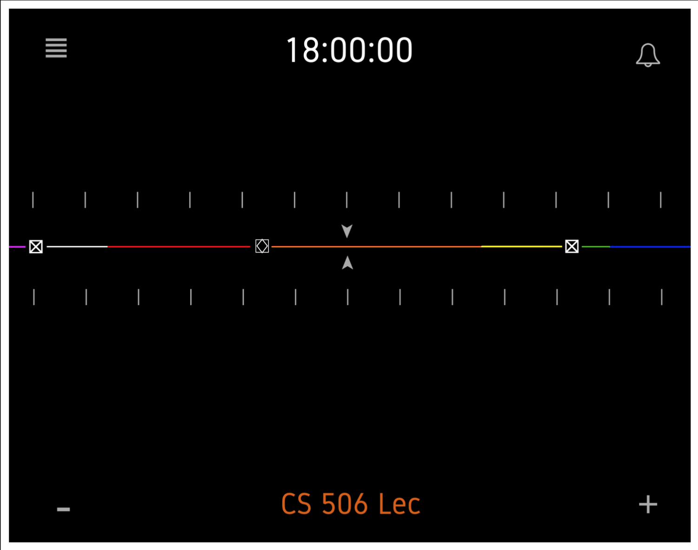
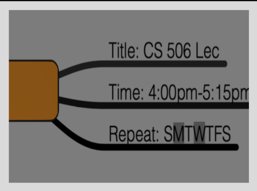

# TRACE
## Design and Planning Document

### Contents

#### 1. System Architecture

1.1. Overview
1.2. Event-Based architecture 
1.3. Notification Service
1.4. Alternate architectural Design
1.5. Design Risks

#### 2. Design Details

2.1. iOS Backend Design
2.2. iOS User Interface Design 
2.3. Notifications Design
2.4. UI View Details

#### 3. Implementation Plan

3.1. Dependencies
3.2. Iteration 1
3.3. Iteration 2
3.4. Iteration 3

#### 4. Testing Plan

4.1. Unit Testing
4.2. Integration Testing
4.3. System Testing
4.4. Performance Testing 
4.5. Compatibility Testing 
4.6. Regression Testing 
4.7. Beta Testing

  - [Problem Description](#Problem-Description "Problem Description")
  - [The Customer](#The-Customer "The Customer")
  - [System Description](#System-Description "System Description")
  - [Testing and Demoing](#Testing-and-Demoing "Testing and Demoing")
  - [Feasibility](#Feasibility "Feasibility")
  - [Concept Images](#Concept-Images "Concept Images")

### System Architecture

#### 1.1 Overview

The Trace application will use an Event-Based Software Architecture. We chose this architecture over others because minimalism is the core foundation of the creation of this app. To fuel efficiency within our app, we plan to not need a server at all. Trace is very individual, a basic tool for the user to be able to plan and execute their daily routine, while accommodating outside factors (Unknown plans or events). This means having an application that is meant to mostly display data to the user, while allowing them to trigger specific events to occur, events such as adding specific tasks, cues and alerts.

#### 1.2 Event-Based Architecture

##### 1.2.1 Events

An event is any significant change that affects the software or hardware of the application. In the case of Trace, an event could come from the user, by adding or removing tasks, alerts, or cues from their timelines, changing any of the Notifications settings for Tasks, Cues or Alerts, or altering the Options for the application as a whole. Events could also come from the application itself in the form of notifications being sent to the users device regarding specific events that the user has set up to be notified about.

##### 1.2.2 User Interface Architecture

The IOS application interface, Xcode, serves as the view for this application. The user interface is developed completely in Swift. The individual screens and functionality of the UI can be described with the Action Sequence Flow pictured below. Each individual screen is depicted by a light green oval, initially the timeline will be displayed to the user. This is where the user will be able to see their Tasks, Alerts and Cues that they have set up to be displayed previously. From there, the user has the option to go to the Notification Settings screen. This screen will consist of tabs for Tasks, Alert and Cues that will drop down into specific settings such as time and frequency of notifications. From the Display Timeline screen, the user will also be able to add Tasks, Alerts and Cues, by pressing the add button, which will present a pop up allowing them to set the description and time of the tool they selected. The user will also be able to delete a tool by pressing the delete button, which will present a pop up listing the tools they already have set in place. Finally, from the Display Timeline screen, the user will be able to navigate to the Options screen by pressing the Options button, which will allow them to select the display type, toggle color blind mode, toggle dark mode and choose their time format.

## Concept Images:
⃞♢ = cues

⊠ = alerts

Colors indicate tasks

Task expanded view:

